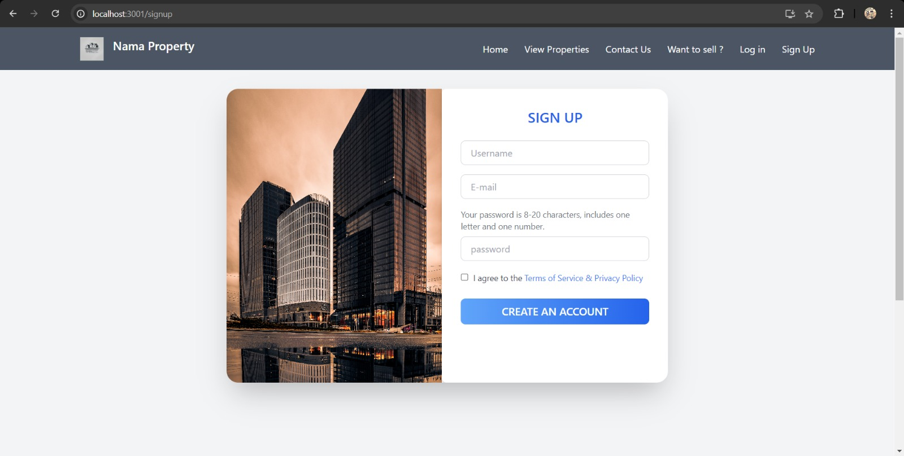
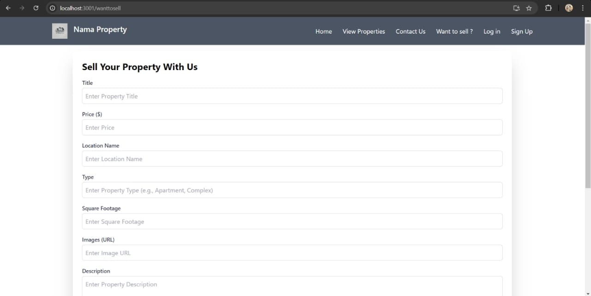
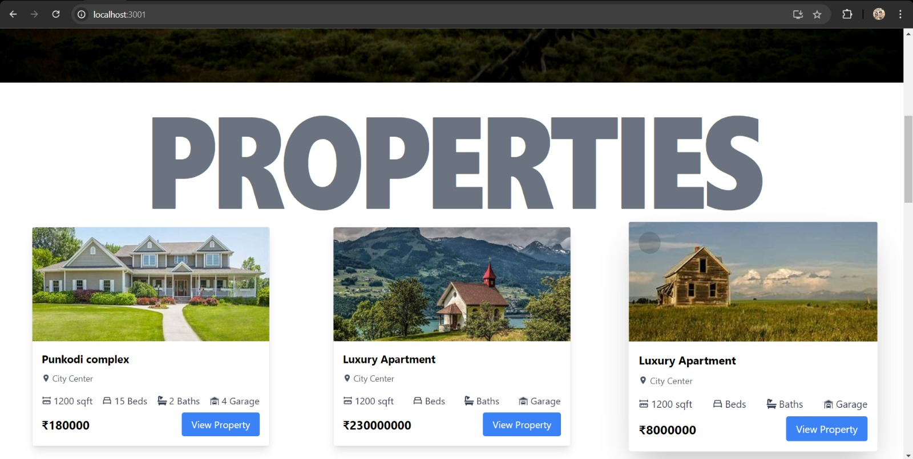

# 🏠 Namma Property

*Namma Property* is a real estate website built for a hackathon where:

- 🧑‍💼 Sellers can list properties for sale
- 🧑‍💻 Buyers can filter and search for specific properties

---

## 🔧 Tech Stack

- *Node.js & Express.js* – Backend server
- *MongoDB* – Database
- *JWT* – Authentication
- *Redux Toolkit* – State management
- *Tailwind CSS* – UI styling

---

## ✨ Features

- Seller authentication & property listing
- Buyer-side property filtering
- JWT-based secure login
- Fully responsive design with Tailwind CSS

---

## 📸 Demo

> Below are some screenshots of the project in action:

###  Homepage  


###  Authentication  


###  Seller Dashboard  


###  Buyer Dashboard  


###  Testimonals  


###  Property Filter Page  


---

## 🚀 Getting Started

```bash
# Clone the repository
git clone https://github.com/your-username/namma-property.git
cd namma-property

# Backend setup
cd backend
npm install
npm run dev

# Frontend setup (in another terminal)
cd frontend
npm install
npm start
